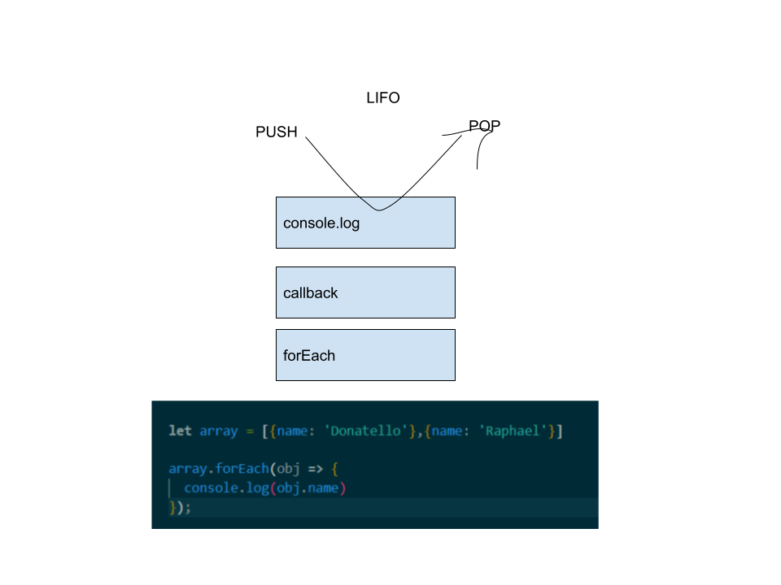

# Code 301 - Class 10

## [JS Call Stack](https://www.freecodecamp.org/news/understanding-the-javascript-call-stack-861e41ae61d4)

1. What is a ‘call’?
A function invocation.

2. How many ‘calls’ can happen at once?
One.

3. What does LIFO mean?
Last in, first out.

4. Draw an example of a call stack and the functions that would need to be invoked to generate that call stack.

5. What causes a Stack Overflow?
A stack overflow occurs when there is a recursive function (a function that calls itself) without an exit point. The browser (hosting environment) has a maximum stack call that it can accomodate before throwing a stack error.

